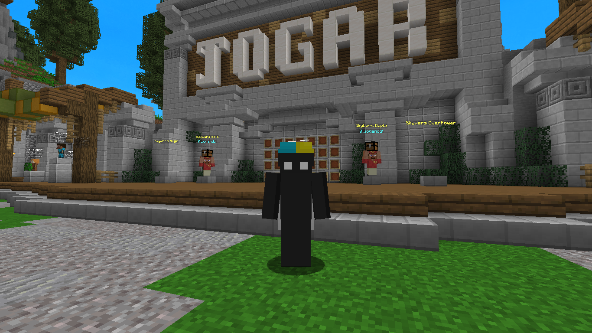

# PLUGIN SKYWARS



> PLUGIN USADO E EDITADO "TALONSKYWARS".

### Ajustes e melhorias

O projeto ainda está em desenvolvimento e as próximas atualizações serão voltadas para as seguintes tarefas:

- [x] Otimização do plugin
- [x] Análise e correção de erros
- [x] Testes individuais
- [x] Testes em conjunto
- [x] Finalização do projeto

## 💻 Pré-requisitos

Antes de começar, verifique se você atendeu aos seguintes requisitos:

- Teste em algum backup de seu servidor.
- Na edição dos arquivos está especificando como colocar os npcs no mapa.
- Recomendável minecraft 1.8

## 🚀 Instalando o Plugin

Para instalar o plugin, siga estas etapas:

```
Baixar a pasta com o plugin e pasta, adicione o arquivo e pasta na pasta plugins.
```

## ☕ Usando o Plugin

Para usar o plugin, siga estas etapas:

```
Consulte a pasta do "TSkyWars/config" lá haverá os comandos, dentro do jogo dê /sw
```

## 📝 Licença

Esse projeto está sob licença. Veja o arquivo [LICENÇA](LICENSE.md) para mais detalhes.
